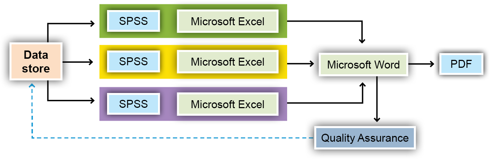
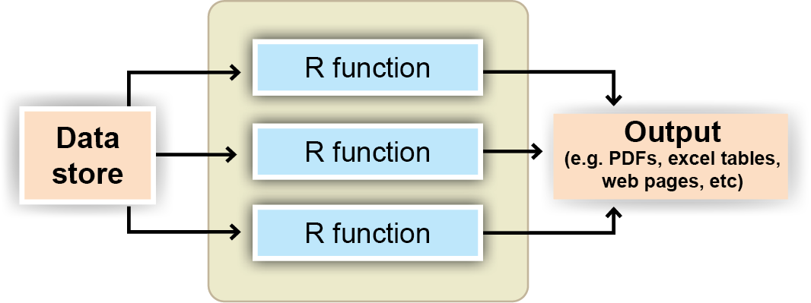
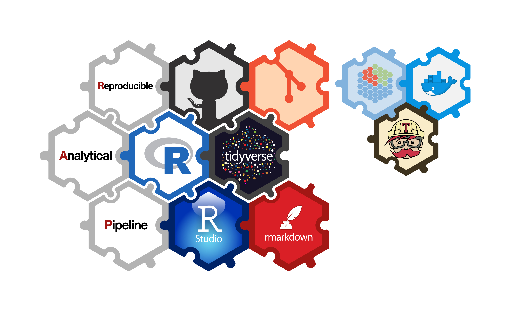
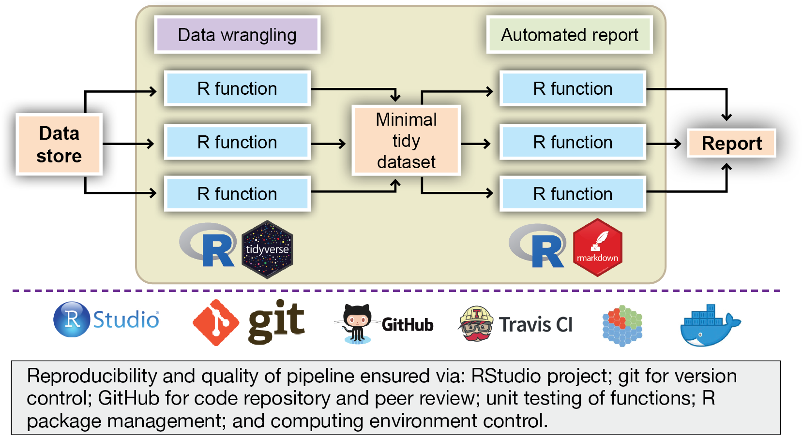

```{r setup, include = FALSE}
library(knitr)
library(magrittr)
library(kableExtra)

knitr::opts_chunk$set(echo = FALSE)

# Create data frame for levels of automation table
automation_levels <- data.frame(c(1:3, c("4a", "4b"), 5:7),
                                c("Ad hoc R code",
                                  "R project",
                                  "R project under version control (VC)",
                                  "R project under VC and peer reviewed (wrangling)",
                                  "Replicable report in Rmarkdown (publication)",
                                  "Near RAP (VC, peer review, data quality assurance)",
                                  "Full RAP (as above plus unit testing and documentation)",
                                  "R package"))
```
## Current publication process

```{r out.width = "80%", fig.align='center'}

```

- Complex (many steps between software)
- Prone to error
- Manual, menial tasks carried out by highly skilled people
- Not reproducible or sustainable


## The solution

```{r out.width = "60%", , fig.align = 'center'}
include_graphics("images/rap_matts.png")
```

[RAP companion](https://ukgovdatascience.github.io/rap_companion/)

Combined the principles of **reproducible research** with **data science tools and best practice**.

```{r out.width = "55%", fig.align = 'center'}

```


## What is RAP?

- No (or few) manual steps = data and output produced using code
- High quality and auditable = version control
- Sustainable = peer review
- "Bells and whistles" = _functions, documenting/testing these functions, package management and computing environment_

```{r out.width = "60%", fig.align = 'center'}

```


## What is RAP?

```{r out.width = "100%", fig.align = 'center'}

```


## [Levels of RAP/automation](https://www.isdscotland.org/About-ISD/Methodologies/_docs/Reproducible_Analytical_Pipelines_paper_v1.4.pdf)

```{r, echo = FALSE}
    kable(automation_levels,
          col.names = c("Level", "Description"),
          format = "markdown")
```


## Challenges
- Senior management buy in
- Culture change (peer review and working in the open)
- New skills for analysts to learn (e.g. R, git)
- Required development time
- Range of data sources and/or unstable production process
- IT (RStudio server and internally hosted code repository)


## How to scale RAP in ISD?

- The [Transforming Publishing](https://www.isdscotland.org/Products-and-Services/Transforming-Publishing-Programme/) (TPP) team have begun to roll out RAP to other teams in ISD using a buddy system

- One or two members of TPP 'buddy up' with another team to help them create a 
Reproducible Analytical Pipeline for their publication

- The bulk of the development work is done by the team being 'buddied'; TPP use a light touch approach to provide code reviews; 
offer assistance with R and Git; advise on timelines; and, more generally, offer guidance wherever it is required

- As a minimum, we recommend teams aim for level 4 (a or b or both) as laid out in our [RAP paper](https://www.isdscotland.org/About-ISD/Methodologies/_docs/Reproducible_Analytical_Pipelines_paper_v1.4.pdf)


## Before the buddying

- Prior to working on RAP, analysts in ISD must attend an introductory Tidyverse 
training course (run by [Jumping Rivers](https://www.jumpingrivers.com/)) and 
a tutorial on using Git and GitHub (run internally by TPP)

- Following this, we ask them to complete an [R Skills survey](https://www.nsssurvey2.scot.nhs.uk/index.php?r=survey/index/sid/296986/lang/en) 
and a [short exercise](https://github.com/NHS-NSS-transforming-publications/R-exercise) 
to assess their competence with R

- We also ask them to look at our [Toolkit](https://github.com/NHS-NSS-transforming-publications/Toolkit), which 
contains links to our resources on R, RMarkdown, version control, RAP, shiny 
and more


## Buddying in action

- The first publication to undergo the buddy system is the [Scottish Bowel Screening Programme Statistics](https://www.isdscotland.org/Health-Topics/Cancer/Publications/2018-08-07/2018-08-07-Bowel-Screening-Publication-Report.pdf?8727663756) (SBSS)

- Two analysts created a document detailing the sections of their publication 
report which required to be automated

- They also created a plan detailing the scripts they required to write and the 
associated timelines updated fortnightly

- Since the beginning of April, they've converted most of the back end of the 
publication from SPSS to a version controlled, peer reviewed R project held in a 
GitHub repository

- Other publications we are buddying with: End of Life Care, Medicines and Mental Health, Cancelled Planned Operations


## Interested in RAP?...

- How many reports do your team produce?
- What proportion of time is spent producing reports?
- How much copying and pasting/data movement between software is involved?
- What proportion of your spreadsheet or report contains errors?
- What would the impact of mistakes in production be?
- Could your team create the report if certain team members suddenly left?
- Could you reproduce your publication statistics from 5 years ago?

Contact the Transforming Publishing team (nss.isdtransformingpublishing@nhs.net)


## Thank You {.smaller}

Contact Transforming Publishing: nss.isdtransformingpublishing@nhs.net

[Transforming Publishing web pages](http://www.isdscotland.org/Products-and-Services/Transforming-Publishing-Programme/)

[Transforming Publishing on GitHub](https://github.com/NHS-NSS-transforming-publications)

[PHI on GitHub](https://github.com/Health-SocialCare-Scotland)

[RAP companion](https://ukgovdatascience.github.io/rap_companion/)